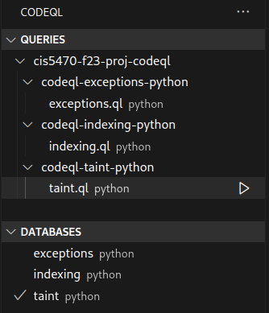

# Python CodeQL Analysis

Authors: Zain Aamer, Jeff Tao, Zed Wu

# Instructions

To generate CodeQL databases (you must have the `codeql` CLI installed):

```
make db
```

To run queries, you must have the VS Code CodeQL extension installed.
If the databases do not appear in the sidebar, build the databases with the commad above and restart VS Code.



Be sure to select the corresponding database when executing a query (e.g. run `taint.ql` on the `taint` database).
